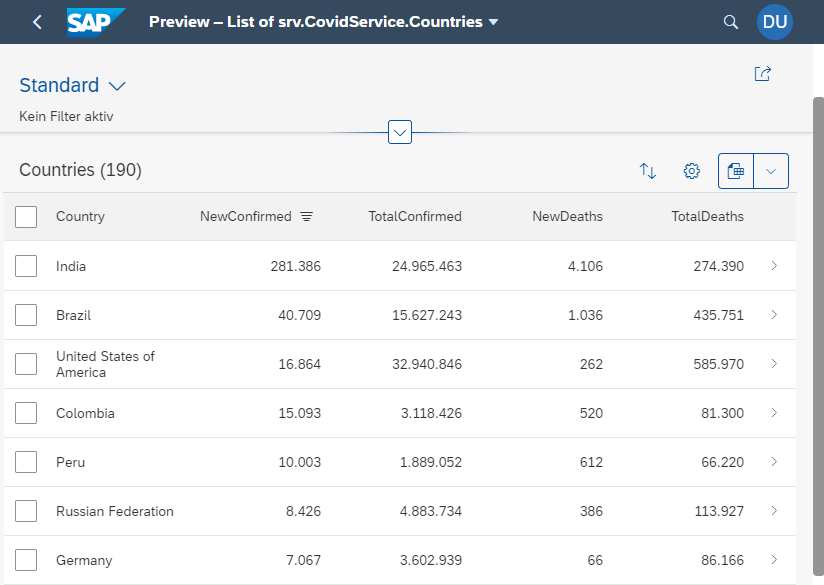
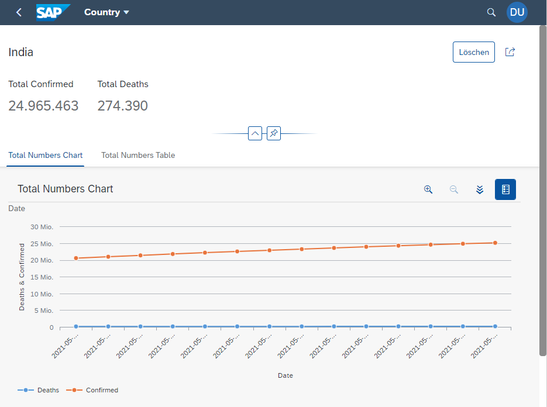

# Yet another covid-19 tracker using CAP + Fiori Elements

This is a sample project to evaluate and explore some capabilities of SAP CAP and Fiori Elements.

The goal was to better understand and learn how to:

- Call a **remote service** with standard SAP CAP APIs
- Explore options to map **REST to OData Services**
- Visualize Data with **Fiori Elements**

## Screenshots

## Project Structure

| File or Folder | Purpose                             |
| -------------- | ----------------------------------- |
| `app/`         | content for UI frontends (not used) |
| `db/`          | domain models and mock data         |
| `srv/`         | service models                      |
| `srv/external` | call and mapping of remote service  |
| `package.json` | project metadata and configuration  |
| `.cdsrc.json`  | config file for CAP                 |

## Run the application

- Open a new terminal and run `cds watch`
- (in VS Code simply choose _**Terminal** > Run Task > cds watch_)
- Open <http://localhost:4004>
- Choose the build-in Fiori-Preview option of the Service `srv.CovidService/Countries`: <http://localhost:4004/$fiori-preview/srv.CovidService/Countries#preview-app>

## Docker

- Build the docker container: `docker build -t covid-tracker .`
- Run the docker container and expose the running port: `docker run -p 80:4004 -t covid-tracker`
- sh into docker container to check whats going on inside: `docker run -i -t covid-tracker /bin/sh`

Publish to Docker Hub:

- Tag the container: `docker tag covid-tracker kniklas/cap-covid-tracker`
- Publish `docker push kniklas/cap-covid-tracker`

## Learn more

Find more information about this repository in my blog post

- [SAP CAP Remote Services & SAP Fiori Elements](https://blog.kai-niklas.de/posts/9-sap-cap-remote-services-fiori-elements)
